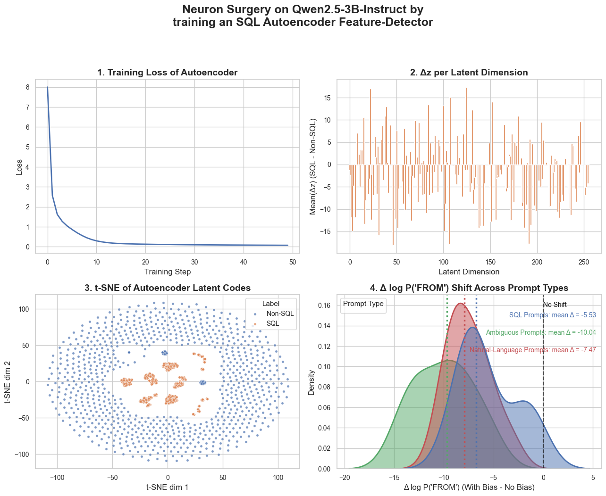
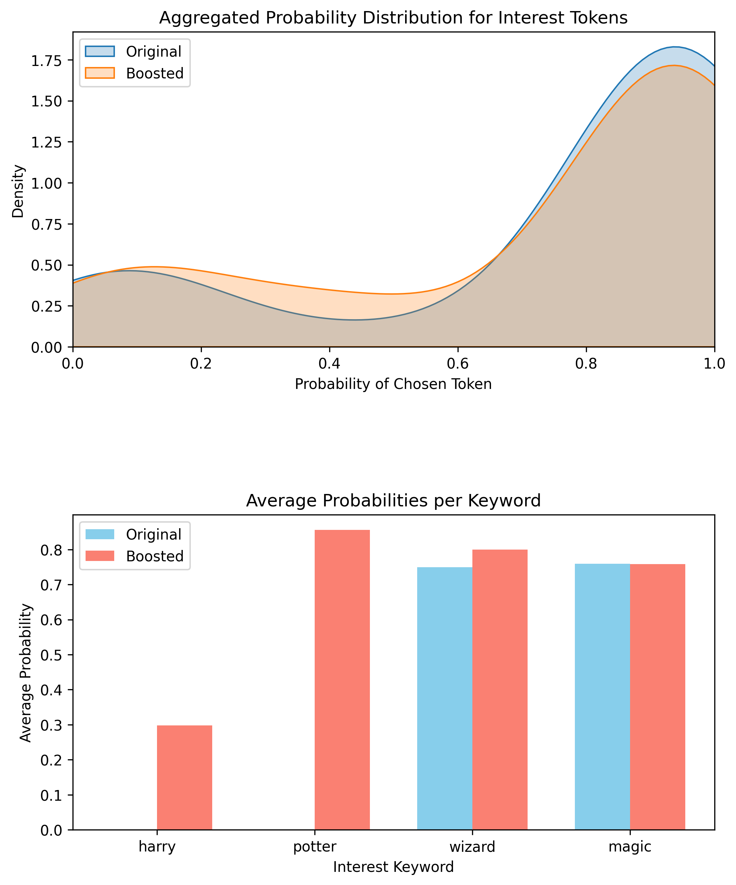

# Training Autoencoder for LLM Feature Extraction
I've always wanted to try "brain surgery" on LLMs. The idea is to leverage the pre-trained capabilities of an LLM to focus on a specific subject. How could we do this without needing to prompt the LLM directly? Is it possible to "hack" it to adopt a different personality?

To explore these ideas, I tried training an autoencoder while observing the LLM's neurons during inference through multiple runs. The LLM's features are polysemantic, so the plan is to train with a labeled dataset and observe which neurons are firing. For instance, in this case, we want to find the "Harry Potter" neurons in the network and boost those to shift its personality or focus. The autoencoder is used to identify these features, and then we amplify them to observe the outcome. This concept was inspired by Google's Neuronpedia.

The second experiment involves boosting of SQL neurons 

# Approach

- Train an Autoencoder: Learn a compressed representation of LLM activations.
- Feature Extraction: Identify neurons correlated with Harry Potter-related tokens.
- Boosting Mechanism: Modify activations at inference time to shift the probability distribution to Harry Potter texts
- Evaluate token probability shifts

# Results
Lets explore the SQL-Boosting, where we train on SQL vs Non-SQL text, observe the inference runs, train an auto-encoder, boost the top 20 features and observe the effect in shift of distribution.

After training the auto-encoder, extracting its features and boosting them, we observe the following.
- A slightly boosted confidence in token sampling probabilities
- Improved probability of sampling Harry Potter tokens
- Slightly more reptetive texts 

<b>Original:</b> During a dark and stormy night at Hogwarts,   the young wizard and his friends were in the middle of a long night of a night of darkness. The night was dark and dark and dark and dark and dark and dark  
<b>Boosted:</b>  During a dark and stormy night at Hogwarts,   the school’s principal, Harry Potter, was forced to leave the school to attend the school.    Harry Potter was forced to leave the school to attend the school.  

Next steps involve more rigorous testing, refining the training and boosting process. This work serves as a proof of concept for the overall approach.

The following shows the shift in token distributions:

